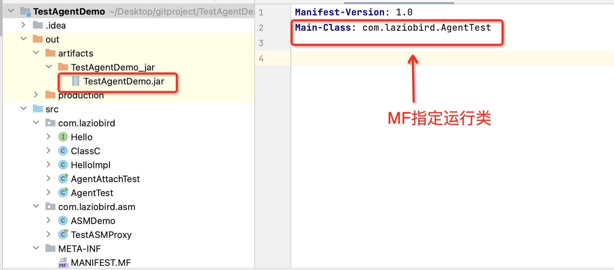
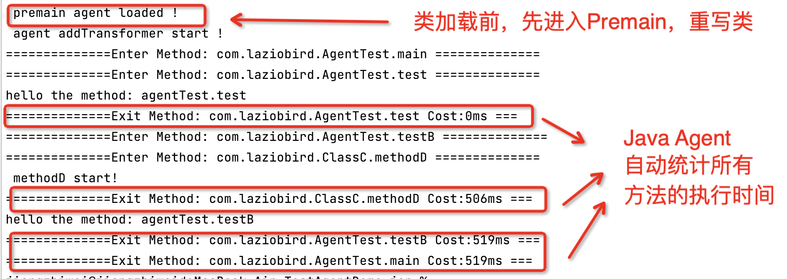

# java-agent-demo
Tell you how to write a common java agent  and learn some core  implements.

### Premain 模式Java Agent探针实现过程

#### 目标

>实现一个简单性能工具，通过探针统计Java程序所有方法的执行时间

1、构建 Maven 项目工程，添加 MANIFEST.MF , 目录大致


在 `MANIFEST.MF`文件中定义`Premain-Class`属性，指定一个实现类。类中实现了Premain方法，这就是Java Agent 在类加载启动入口

```xml
Manifest-Version: 1.0
Premain-Class: com.laziobird.MyAgentDemo
Agent-Class: com.laziobird.MyAgentDemo
Can-Redefine-Classes: true
Can-Retransform-Classes: true
```
* `Premain-Class`包含Premain方法的类
* `Can-Redefine-Classes`为true时表示能够重新定义Class
* `Can-Retransform-Classes`为true时表示能够重新转换Class，实现字节码替换
2、构建Premain方法

```xml
public class MyAgentDemo {
    // JVM 启动时，Agent修改字节码
    public static void premain(String args, Instrumentation inst) {
        System.out.println(" premain agent loaded !");
        inst.addTransformer(new PreMainTransformerDemo());
        System.out.println(" agent addTransformer start !");
    }
 ....   
}
```
我们实现Premain方法类叫 `MyAgentDemo`，里面添加一个类转化器  `PreMainTransformerDemo`，这个转化器具体来实现统计方法调用时间
3、编写类转换器

在编写类转化器时，我们通过Javassist 来具体操作字节码，首先`pom.xml` 里面添加依赖

```xml
<dependency>
   <groupId>org.javassist</groupId>
   <artifactId>javassist</artifactId>
   <version>3.25.0-GA</version>
</dependency>
```
接下来具体实现
```java
public class PreMainTransformerDemo implements ClassFileTransformer{
   final static String prefix = "\nlong startTime = System.currentTimeMillis();\n";
   final static String postfix = "\nlong endTime = System.currentTimeMillis();\n";
   @Override
   public byte[] transform(ClassLoader loader, String className, Class<?> classBeingRedefined,
                           ProtectionDomain protectionDomain, byte[] classfileBuffer){
       // className 默认格式 com/laziobird 替换 com.laziobird
       className = className.replace("/", ".");
       //java自带的方法不进行处理,不是特别类的方法也不处理
       if(className.startsWith("java") || className.startsWith("sun")|| !className.contains("com.laziobird")){
           return null;
       }
       CtClass ctclass = null;
       try {
           // 使用全称,用于取得字节码类<使用javassist>
           ctclass = ClassPool.getDefault().get(className);
           for(CtMethod ctMethod : ctclass.getDeclaredMethods()){
               String methodName = ctMethod.getName();
               // 新定义一个方法叫做比如sayHello$old
               String newMethodName = methodName + "$old";
               // 将原来的方法名字修改
               ctMethod.setName(newMethodName);
               // 创建新的方法，复制原来的方法，名字为原来的名字
               CtMethod newMethod = CtNewMethod.copy(ctMethod, methodName, ctclass, null);
               // 构建新的方法体
               StringBuilder bodyStr = new StringBuilder();
               bodyStr.append("{");
               bodyStr.append("System.out.println(\"==============Enter Method: " + className + "." + methodName + " ==============\");");
               //方法执行前，定义一个时间变量，记录方法开始前时间
               bodyStr.append(prefix);
               bodyStr.append(newMethodName + "($$);\n");// 调用原有代码，类似于method();($$)表示所有的参数
               //定义方法完成时间变量
               bodyStr.append(postfix);
               //方法完成后，运算方法执行时间
               bodyStr.append("System.out.println(\"==============Exit Method: " + className + "." + methodName + " Cost:\" +(endTime - startTime) +\"ms " + "===\");");
               bodyStr.append("}");
               // 新方法字节码替换原来的方法字节码
               newMethod.setBody(bodyStr.toString());
               ctclass.addMethod(newMethod);// 增加新方法
           }
           //返回新的字节流
           return ctclass.toBytecode();
       } catch (Exception e) {
           e.printStackTrace();
       }
       return null;
   }
```
这段程序等价于：把指定Java类下所有方法进行了如下转换，重新生成字节码加载执行


4、打包生成Java Agent的Jar 包

在`pom.xml`配置好`maven assembly`，进行编译打包


5、写一个Java测试程序，验证探针是否生效

类`AgentTest` 有两个简单方法`test`、`testB`

为了演示，其中testB 调用了另外一个类`ClassC` 的 `methodD`方法。

可以看到，类包名是 `com.laziobird`，刚才的Agent 只会对`com.laziobird` 的类起作用

```java
package com.laziobird;
public class AgentTest {
    public void test() {
        System.out.println("hello the method: agentTest.test ");
    }
    public void testB() {
        ClassC c = new ClassC();
        c.methodD();
        System.out.println("hello the method: agentTest.testB ");
    }
    public static void main(String[] args) {
        AgentTest agentTest = new AgentTest();
        agentTest.test();
        agentTest.testB();
    }
}
package com.laziobird;
public class ClassC {
    public void methodD(){
        try {
            System.out.println(" methodD start!");
            Thread.sleep(500);
        } catch (InterruptedException e) {
            throw new RuntimeException(e);
        }
    }
}
```
我们给测试程序打成可执行的Jar包，Jar 指定默认运行的类是 `AgentTest`  


运行测试程序，通过`-javaagent`启动我们写的 Java Agent 探针

```xml
java -javaagent:/path/agentdemo/target/javaagent-demo-0.0.1-SNAPSHOT-jar-with-dependencies.jar  
-jar  /path/gitproject/TestAgentDemo/out/artifacts/TestAgentDemo_jar/TestAgentDemo.jar
```
#### 运行效果




### 基于Attach模式 Java Agent 探针实现过程

#### 目标

实现一个简单性能工具，通过Java Agent 探针统计Java应用程序下所有方法的执行时间

1、还是之前 Maven 项目工程，在 `MANIFEST.MF` 文件中定义`Agentmain-Class`属性，指定一个实现类。类中实现了`Agentmain`方法，这就是Java Agent 在JVM运行时加载的启动入口

```xml
Agent-Class: com.laziobird.MyAgentDemo
```
2、构建Agentmain方法
```java
public class MyAgentDemo {
  // JVM运行时，Agent修改字节码
  public static void agentmain(String args, Instrumentation inst) {
      System.out.println(" agentmain agent loaded !");
      Class[] allClass = inst.getAllLoadedClasses();
      for (Class c : allClass) {
          inst.addTransformer(new AgentMainTransformerDemo(), true);
          try {
          //agentmain 是JVM运行时，需要调用 retransformClasses 重定义类 ！！
          inst.retransformClasses(c);
               } catch (UnmodifiableClassException e) {
                 throw new RuntimeException(e); }
          }    }
 ....   
}
```
我们在类 `MyAgentDemo`实现`agentmain`方法，里面添加一个类转化器  `AgentMainTransformerDemo`，这个转化器插入实现统计方法调用时间的字节码片段
```java
public class AgentMainTransformerDemo implements ClassFileTransformer {
    @Override
    public byte[] transform(ClassLoader loader, String className, Class<?> classBeingRedefined,
                            ProtectionDomain protectionDomain, byte[] classfileBuffer) throws IllegalClassFormatException {
        className = className.replace("/", ".");
        //这次我们用另外一种简洁API方法修改字节码
        if (className.contains("com.laziobird")) {
            try {
                // 得到类信息
                CtClass ctclass = ClassPool.getDefault().get(className);
                for (CtMethod ctMethod : ctclass.getDeclaredMethods()) {
                    // 方法内部声明局部变量
                    ctMethod.addLocalVariable("start", CtClass.longType);
                    // 方法前插入Java代码片段
                    ctMethod.insertBefore("start = System.currentTimeMillis();");
                    String methodName = ctMethod.getLongName();
                    ctMethod.insertAfter("System.out.println(\"" + methodName + " cost: \" + (System" +
                            ".currentTimeMillis() - start));");
                    // 方法结束尾部插入Java代码片段
                    return ctclass.toBytecode();
                }
            } catch (Exception e) {
                e.printStackTrace();
            }
        }
        return null;
    }
}
```
3、重新打包生成新的Jar包
运行 `maven assembly`，进行编译打包

4、写测试的Java程序

类AgentAttachTest 定义一个方法，为了方便查看Attach 效果，我们让JVM 主进程一直循环执行这个方法。同时为了区分，通过随机数改变方法的运行时间。这样看到探针每次统计结果也不同。类的包名是`com.laziobird`，Agent 只会对`com.laziobird` 的类起作用

```java
public void test(int x) {
    try {
        long sleepTime = x*1000;
        Thread.sleep(sleepTime);
        System.out.println("the method: AgentAttachTest.test | sleep time = " + sleepTime+ "ms");
    } catch (InterruptedException e) {
        throw new RuntimeException(e);
    }
}
public static void main(String[] args) {
    AgentAttachTest agentTest = new AgentAttachTest();
    while (1==1){
        int x = new Random().nextInt(10);
        agentTest.test(x);
    }
}
```
5、编写一个演示 Attach 通信的JVM 程序，用于启动 Agent
```java
public class AttachJVM {
    public static void main(String[] args) throws IOException, AttachNotSupportedException, AgentLoadException, AgentInitializationException {
        // 获取运行中的JVM列表
        List<VirtualMachineDescriptor> vmList = VirtualMachine.list();
        // 我们编写探针的Jar包路径
        String agentJar = "/Users/jiangzhiwei/eclipse-workspace/agentdemo/target/javaagent-demo-0.0.1-SNAPSHOT-jar-with-dependencies.jar";
        for (VirtualMachineDescriptor vmd : vmList) {
            // 找到测试的JVM
            System.out.println("vmd name: "+vmd.displayName());
            if (vmd.displayName().endsWith("AgentAttachTest")) {
                // attach到目标ID的JVM上
                VirtualMachine virtualMachine = VirtualMachine.attach(vmd.id());
                // agent指定jar包到已经attach的JVM上
                virtualMachine.loadAgent(agentJar);
                virtualMachine.detach();
}}}}
```
### 运行效果

1、运行测试的Java程序，为了方便，也可以不用打成Jar运行


2、我们启动Attach 的JVM程序。它主要动作：

1、通过Attach API，找到要监听的JVM进程，我们称为VirtualMachine

2、VirtualMachine 借助Attach API 的`LoadAgent`方法将Agent 加载进来


3、Agent 开始工作！我们回过头来看看探针在测试程序的运行效果


我们手写Java 探针在JVM 运行时也能动态改变字节码。

